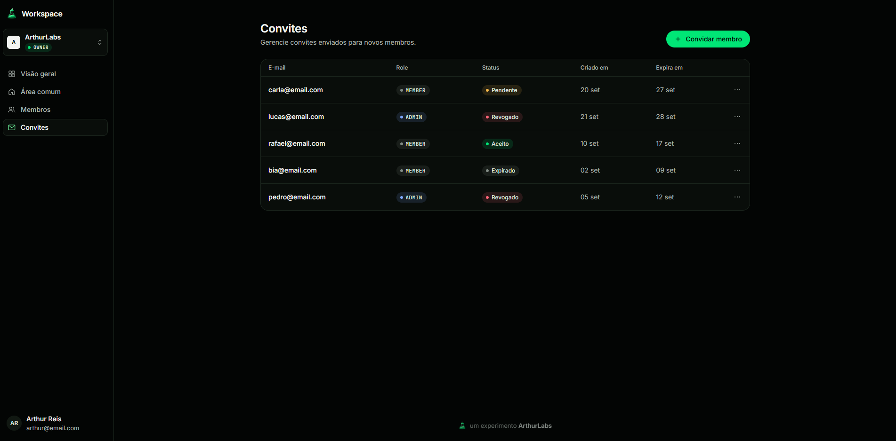
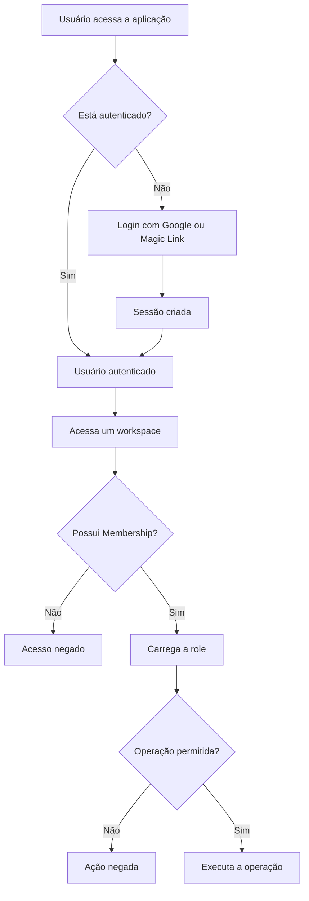

# Workspace

Experimento de **autenticação e autorização** com workspaces, membros e roles, para estudar a diferença entre provar quem é o usuário e decidir o que ele pode acessar ou fazer dentro de uma aplicação.

**Demo:** 

**Post no Lab:** _em breve_

## Contexto

Autenticação e autorização costumam aparecer juntas, mas respondem a perguntas diferentes:

```text
Autenticação → Quem é você?
Autorização → Você pode fazer isso?
```

Depois do login, a aplicação conhece a identidade do usuário. Isso não lhe dá acesso a todos os recursos. Arthur, por exemplo, pode usar a mesma conta e ter responsabilidades diferentes em cada ambiente:

```text
Arthur
├── ArthurLabs    → OWNER
├── Studio        → ADMIN
└── Client Portal → MEMBER
```

A relação entre uma identidade e um ambiente é a **Membership**:

```text
User + Workspace = Membership
```

A role pertence a essa relação, não ao `User`. Assim, uma única identidade pode participar de vários workspaces sem precisar de uma permissão global que valha para todos eles.

Antes de permitir uma operação, o experimento distingue três perguntas:

1. O usuário está autenticado?
2. O usuário pertence a este workspace?
3. A role dele permite executar esta operação?

```text
Authentication
    ↓
Membership
    ↓
Authorization
```

## Autenticação

Autenticar é estabelecer **quem está usando a aplicação**. O login pode acontecer com Google ou por Magic Link enviado por e-mail. Em ambos os casos, o Auth.js cria uma sessão que permite reconhecer o usuário nas próximas requisições.

```text
usuário → login → Auth.js → sessão → usuário autenticado
```

Uma página protegida pode encaminhar quem não tem sessão para `/login`. Uma Server Action também precisa verificar a sessão por conta própria: proteger a navegação não protege automaticamente uma operação chamada pelo cliente. Para uma ausência de autenticação esperada, a action pode devolver um resultado legível pela interface:

```text
{ success: false, data: null, message: "Usuário não autenticado." }
```

A sessão responde à primeira pergunta. Ela ainda não informa em quais workspaces o usuário participa nem quais operações pode executar.

## Membership

Ao acessar `/workspaces/arthurlabs`, a aplicação precisa verificar se existe uma `Membership` entre o usuário autenticado e aquele workspace:

```text
userId + workspaceId
        ↓
   Membership?
   ├── não → acesso negado
   └── sim → acesso ao workspace e role conhecida
```

Cada par `userId + workspaceId` é único. O usuário tem uma Membership e uma role naquele workspace, mas pode ter outra role em outro ambiente.

```text
User → Membership → Workspace
           │
           └── role
```

As roles do experimento são `OWNER`, com o maior controle do workspace; `ADMIN`, com acesso administrativo limitado; e `MEMBER`, que participa sem controles administrativos.

## Autorização

Depois de identificar o usuário e confirmar sua Membership, a aplicação verifica **o que ele pode fazer**. A role influencia tanto o acesso às páginas quanto operações específicas.

Na navegação, `MEMBER` vê Visão geral e Área comum. `OWNER` e `ADMIN` também veem Membros e Convites. Essa diferença melhora a interface, mas **esconder um botão não é autorização**: uma pessoa ainda pode tentar abrir uma URL diretamente ou chamar uma Server Action.

```text
interface → mostra apenas ações disponíveis
servidor  → valida novamente antes de ler ou alterar dados
```

As regras também variam por operação. Nos convites, `OWNER` pode convidar `MEMBER` ou `ADMIN`; `ADMIN` pode convidar somente `MEMBER`. Ninguém convida outro `OWNER`. No gerenciamento de membros, a regra do domínio reserva ao `OWNER` a alteração de role e a remoção de `ADMIN` ou `MEMBER`; `ADMIN` não altera roles e só pode remover `MEMBER`. As ações de alteração e remoção ainda são apenas visuais: quando forem implementadas, essas regras também precisarão ser verificadas no servidor.

## Convites

Um `Invite` não é uma `Membership`. Ele representa uma proposta de entrada em um workspace, inclusive para alguém que ainda não tem conta. Por isso, o destinatário é identificado por **e-mail**, não por `userId`.

```text
OWNER / ADMIN → convite para e-mail → Invite
                                      ↓
                             usuário autentica
                                      ↓
                      e-mail da sessão corresponde?
                                      ↓
                              aceite → Membership
```

O convite guarda o workspace, quem o enviou (`invitedBy`), o e-mail do destinatário, a role oferecida, o status, um token e a data de expiração. Seus estados possíveis são `PENDING`, `ACCEPTED`, `DECLINED`, `REVOKED` e `EXPIRED`. A lista pessoal mostra apenas convites `PENDING` ainda válidos. O aceite e a recusa são etapas futuras; visualizar um convite não torna a pessoa membro.

## Fluxo de acesso



## Exemplo

```text
Arthur
├── Workspace A → OWNER
├── Workspace B → ADMIN
└── Workspace C → MEMBER
```

Arthur é o mesmo usuário e usa a mesma sessão nos três casos. O que muda é a Membership consultada para o workspace atual. A autorização resulta dessa relação e da operação solicitada:

```text
mesmo usuário + mesma sessão + workspace diferente
= permissões diferentes
```

## Models

Os models do Auth.js (`User`, `Account`, `Session` e `VerificationToken`) cuidam da identidade, das contas de login e das sessões. O domínio acrescenta `Workspace`, `Membership` e `Invite`, com os enums `WorkspaceRole` e `InviteStatus`.

```text
User
  │
  ├──────── Membership ──────── Workspace
  │               │
  │               └── role
  │
  └──────── Invite ──────────── Workspace
                  │
                  ├── email
                  ├── role
                  ├── status
                  └── expiresAt
```

`User` representa a identidade autenticada. `Workspace` representa o ambiente. Ele não possui `ownerId`: a propriedade é expressa por `Membership.role = OWNER`, evitando duas fontes de verdade.

`Membership` liga um `User` a um `Workspace`; o par `userId + workspaceId` é único. `Invite` representa o estágio anterior ao pertencimento. No fluxo de aceite previsto, a aplicação valida o convite e o e-mail da sessão, cria a Membership e marca o convite como `ACCEPTED`.

## Stack

| Tecnologia | Uso |
| --- | --- |
| Next.js + TypeScript | Aplicação e Server Components |
| Auth.js | Autenticação e sessões |
| Google OAuth | Login social |
| Resend | Magic Links e envio de convites |
| Prisma ORM | Modelagem e acesso aos dados |
| PostgreSQL | Persistência |
| React Hook Form | Estado dos formulários |
| Zod | Validação no cliente e no servidor |
| Tailwind CSS | Estilização |
| Tailwind Variants | Variantes dos componentes |
| Tailwind Merge | Composição de classes |
| Lucide React | Ícones |

## Rotas

```text
/login                              → autenticação
/workspaces                         → contexto do usuário autenticado
/workspaces/[workspaceSlug]         → acesso por Membership
/workspaces/[workspaceSlug]/members → leitura administrativa de membros
/workspaces/[workspaceSlug]/invites → leitura e envio administrativo de convites
```

## Princípio do experimento

```text
Autenticação = quem é você?
Membership  = de qual workspace você participa?
Autorização = o que você pode fazer nesse workspace?
```

O fluxo completo é: identificar o usuário, verificar seu pertencimento, descobrir sua role e decidir se ela permite a operação. A interface pode refletir essa decisão, mas a validação final precisa acontecer no servidor.

---

Construído por [Arthur Reis](https://buildwitharthur.com.br) como parte do [ArthurLabs Lab](https://arthurlabs.io).
